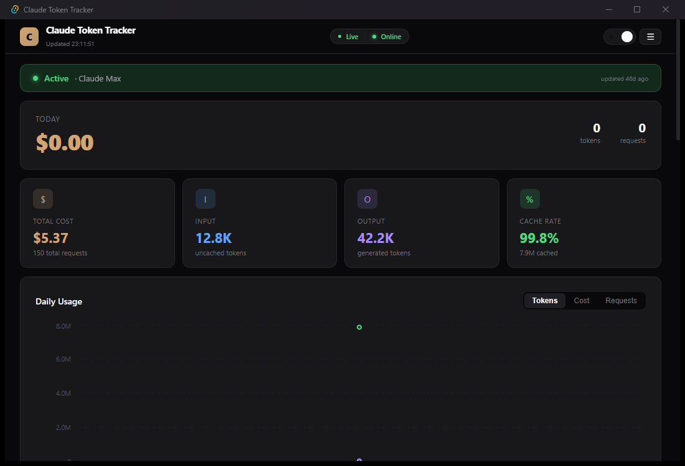
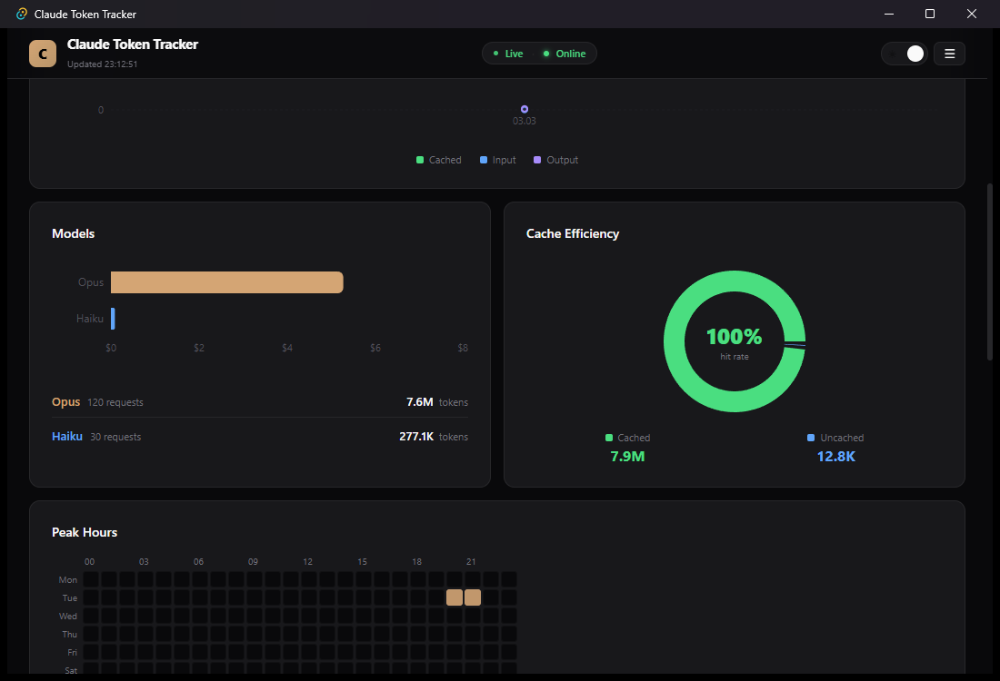
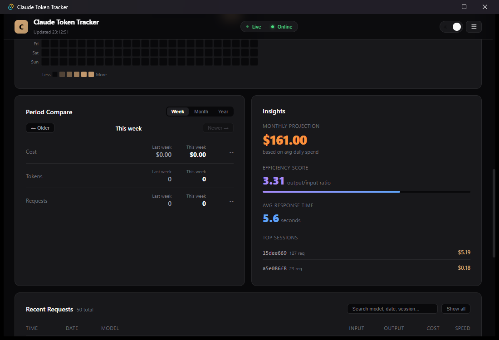
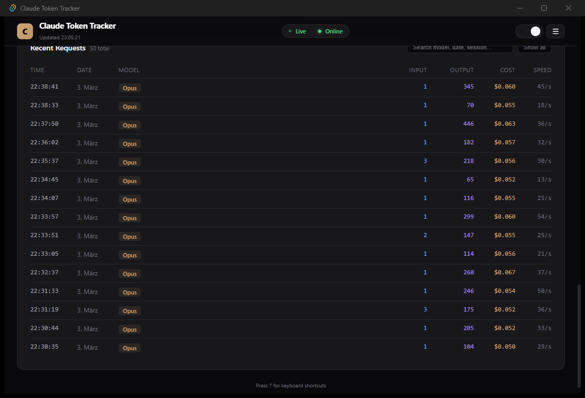

# Claude Token Tracker

**Desktop app that reads your local Claude Code usage data and turns it into a live cost + usage dashboard. Tauri + React, offline-first.**


---

## About

Claude Code writes a telemetry stream to disk every time a request is made. This app reads those events, persists them to a local SQLite database, and renders a dashboard with daily cost, model breakdown, cache-hit rate, request heatmap, and a monthly spend projection — so you can see at a glance where your tokens (and dollars) are going.

Everything runs locally. No data leaves the machine. Optionally, you can paste an Anthropic Console API key to also pull usage from the server side and combine both views.

---

## Screenshots

### Dashboard — today's spend, total cost, token totals, cache-hit rate, daily usage chart


### Models & Cache — per-model breakdown, cache-efficiency donut, peak-hour heatmap


### Insights — period compare, monthly projection, efficiency ratio, top sessions


### Recent Requests — searchable log of every Claude call with cost and speed


---

## Features

- **Live local tracking** — reads `~/.claude/telemetry/` as Claude Code writes it, no polling of Anthropic's servers required
- **SQLite persistence** — every record deduplicated by request ID; history survives across sessions
- **Today / 7d / 30d / all-time** filters (keys `1`–`4`)
- **Per-model breakdown** — cost + token share across Opus / Sonnet / Haiku
- **Cache efficiency** — hit rate and cached-vs-uncached totals (cache pricing is included)
- **Week / Month / Year compare** — delta vs. the previous period
- **Peak-hour heatmap** — day-of-week × hour-of-day usage intensity
- **Insights panel** — monthly projection from your daily average, efficiency score (output/input ratio), avg response time, top sessions by cost
- **Optional API key** — pull server-side usage reports from the Anthropic Console for reconciliation
- **Export** — full history as CSV or JSON
- **Dark / light theme** (key `T`)
- **Keyboard-first** — `R` refresh, `S` settings, `M` menu, `1`–`4` range, `T` theme, `?` shortcuts help, `Esc` close

---

## Tech Stack

| Layer | Technology |
|---|---|
| Backend | Rust, Tauri 2 |
| Database | SQLite (bundled via `rusqlite`) |
| HTTP | `reqwest` (for the optional Console API fetch) |
| Frontend | React 19 + TypeScript + Vite |
| Charts | Recharts |
| Persistence (UI prefs) | `@tauri-apps/plugin-store` |
| Window size | 1100 × 750 |

---

## Getting Started

### Prerequisites

- **Rust** 1.77 or newer (`rustup default stable`)
- **Node.js** 20+ and **npm**
- **OS-specific build tools**:
  - **Windows** — Visual Studio Build Tools (MSVC), WebView2 runtime (pre-installed on Windows 11)
  - **macOS** — Xcode Command Line Tools
  - **Linux** — `libwebkit2gtk-4.1-dev`, `libssl-dev`, build-essential

Full setup reference: [tauri.app/start/prerequisites](https://tauri.app/start/prerequisites/)

### Run in dev mode

```bash
git clone https://github.com/Tschonsen/claude-token-tracker.git
cd claude-token-tracker
npm install
npm run tauri dev
```

First launch compiles the Rust side from source — expect ~1 minute on a fast machine. Subsequent launches are instant.

### Build a release binary

```bash
npm run tauri build
```

Output:
- **Windows** — `src-tauri/target/release/bundle/nsis/*.exe` (installer) and `.../msi/*.msi`
- **macOS** — `src-tauri/target/release/bundle/dmg/*.dmg`
- **Linux** — `src-tauri/target/release/bundle/appimage/*.AppImage` and `.deb`

---

## How it Works

```
┌──────────────────────────┐      ┌──────────────────────────┐
│  ~/.claude/telemetry/    │      │  Anthropic Console API   │
│  1p_failed_events.*.json │      │  (optional, with key)    │
└────────────┬─────────────┘      └────────────┬─────────────┘
             │                                  │
             ▼                                  ▼
        ┌────────────────────────────────────────────┐
        │  Rust backend (src-tauri)                  │
        │  • local_usage.rs — parse telemetry        │
        │  • api.rs         — Console API client     │
        │  • db.rs          — SQLite persistence     │
        │  • lib.rs         — dashboard aggregation  │
        └────────────────────┬───────────────────────┘
                             │  Tauri commands
                             ▼
        ┌────────────────────────────────────────────┐
        │  React frontend (src/components/*)         │
        │  StatusBar · TodayStats · CostSummary      │
        │  UsageChart · ModelBreakdown · CacheStats  │
        │  Heatmap · WeekCompare · Insights          │
        │  RecentRequests · Settings                 │
        └────────────────────────────────────────────┘
```

The backend scans the telemetry directory on each refresh, parses `tengu_api_success` and `tengu_claudeai_limits_status_changed` events, upserts them into SQLite by `requestId`, then re-reads the full history and builds the dashboard payload in one pass.

Pricing for the Console-API path is estimated client-side (`api.rs::estimate_cost`) using published per-1M-token rates for Opus / Sonnet / Haiku.

---

## Project Structure

```
claude-token-tracker/
├── src/                     # React frontend
│   ├── components/          # Dashboard widgets
│   ├── hooks/
│   ├── lib/                 # Types
│   ├── App.tsx
│   └── main.tsx
├── src-tauri/               # Rust backend
│   ├── src/
│   │   ├── main.rs
│   │   ├── lib.rs           # Dashboard aggregation
│   │   ├── api.rs           # Console API client
│   │   ├── db.rs            # SQLite layer
│   │   ├── local_usage.rs   # Telemetry parser
│   │   └── models.rs        # Shared types
│   ├── Cargo.toml
│   └── tauri.conf.json
├── docs/screenshots/
├── package.json
├── vite.config.ts
└── tsconfig.json
```

---

## License

MIT — see [`LICENSE`](LICENSE).
